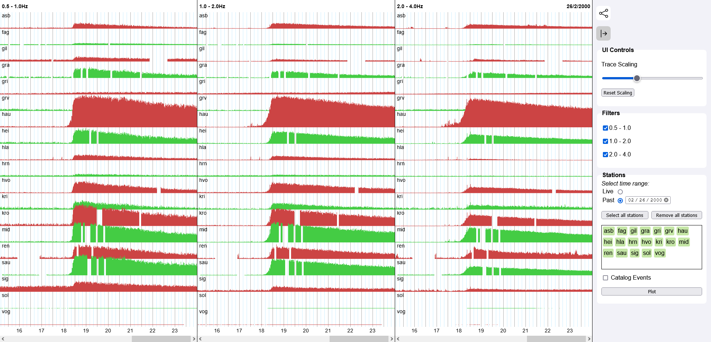

# Tremv Plot
Tremv Plot is a python frontend that connects to a Tremv server and plots data based on user configuration.
The program plots 1-minute rsam values from seismometers the user requests from the Tremv server.
Each requested passband forms a column of plots, which gives a good overview of the activity in the network.
The y-scale on each plot is relative to the maximum value encountered for a given station.

	

This is a pre-release version, as some planned feature are yet to be implemented.
Precompiled binaries for Windows and Linux can be downloaded from the [release page](https://github.com/tremv/tremv_plot/releases).
